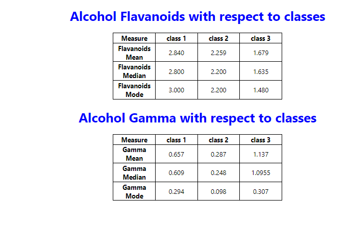

# Move to the project
  move to assign folder by command cd assign

# Install the project
  install project by command npm install or yarn install

# Run the project
  after installation of dependencies run the project by yarn start

# Page inside
  after successful run page look like this
  